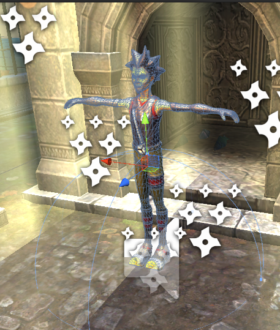
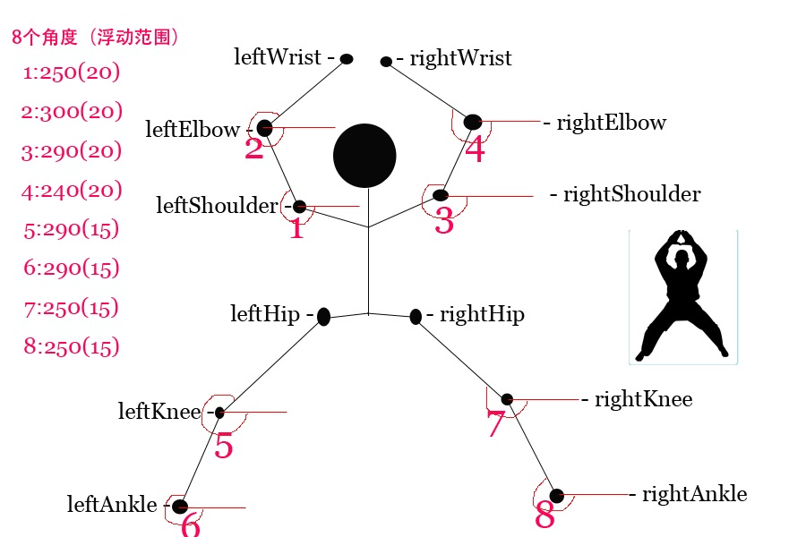
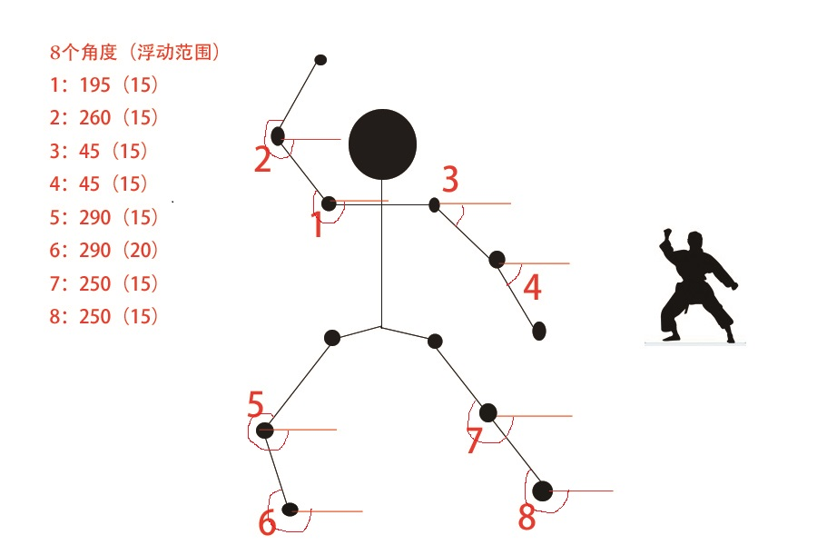
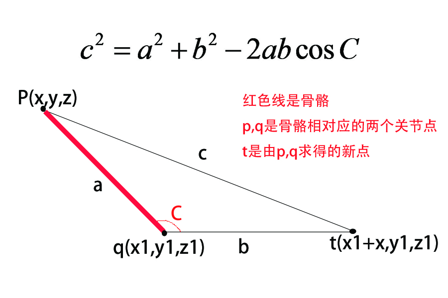

# ActionRecognize

> kinect v2 + unity 动作识别（姿势识别）

* [简介](#1)
* [环境配置](#2)
* [项目准备](#3) 
   * [kinect如何识别动作，并投射在虚拟人物模型上？](#3.1)
   * [如何判定玩家是否做了指定的姿势？](#3.2)
   * [通关后如何控制现实中的门打开？](#3.3)

<h2 id = "1">
简介
</h2>
这是一个体感姿势识别，完成全部指定动作后通关，通关后现实中密室大门打开，逃脱密室。
<h2 id = "2">
环境配置
</h2>
* Vs2012(写脚本的时候基本没有用，用的是unity自带的编译器MonoDevelop)
* .Net Framwork 4.5
* Kinect v2.0 for windows sdk(官网下载在安装之前必须已经安装好vs，安装好后可以用toolkit里面的例子试一下设备可用性) 
* Unity3D 4.6.8 (+Unity%204.x%20Pro%20Patch)(有免费版和专业版)
* Unity引入kinect for unity 插件：Kinect v2 with MS-SDK20.unitypackage

> 到这里环境配置就结束了

我使用的设备是Xbox One专用Kinect感应器，它可以兼容Xbox游戏机来玩游戏，如果再加个适配器，就可以兼容PC机搞编程开发。安装好设备驱动后就能使用啦。[v1,v2,全能感应器的区别](http://www.k4w.cn/show/175.html)。

这些都安装好之后，可以运行一下插件里的demo（也可以运行toolkit里的sample）来看看环境是否配置成功。我选择运行插件（kinect v2插件）里的demo，初次接触unity+kinect，运行demo可以快速了解插件可以实现什么功能。
<h2 id = "3">
项目准备
</h2>
我们要做的是一个姿势识别的通关小游戏，通关后密室大门打开。我们要解决的有以下几个问题：
* kinect如何识别动作，并投射在虚拟人物模型上？
* 如何判定玩家是否做了指定的姿势？
* 通关后如何控制现实中的门打开？

> 通过解决3个关键问题我们开始整个游戏制作的探索！！！（建议先看看插件的代码）

<h3 id = "3.1">
1. kinect如何识别动作，并投射在虚拟人物模型上？
</h3>
还记得之前我们引入了kinect for unity的插件包吗？插件包里有很多demo供我们更直观的了解插件的功能，都运行了一遍发现其中有一个demo的功能就是解决这个问题的，这个demo就是AvatarsDemo。看了一遍脚本后有几个基本知识是我们需要了解的。

 > 先来学几个基本知识吧
 
* 骨骼动画

  简单说一下传统的动画，大家都看过动画，都知道动画是按帧播放的，每一帧记录着物体对象的“动作”信息，为了使动画更流畅在关键帧之间进行插值计算。骨骼动画和传统动画的区别就是，每一帧记录的并不是物体对象的“动作”信息，而是依附在物体对象上的骨骼对象的动作信息，物体对象只记录受到骨骼对象影响的权重（蒙皮权重）。相对于传统的逐帧动画，骨骼动画更适合3d角色游戏。下图是我用到的人物模型（带骨架）：
  
  
* Quaternion四元数

  我们通常所知道的三维旋转有矩阵旋转，欧拉旋转，四元旋转。四元旋转真的好难理解，unity官文里专门提醒了，如果你不了解四元数不要妄图去修改它。虽然四元数代表着旋转一定的角度和rotation的x,y,z有关系，但是看过之后发现并不是对应的，会经过一定的计算进行转换，这个我也在学习中，以后想单独写一篇关于它的文档。这个项目并不需要很深的理解四元数，如果感兴趣可以看看这个[博客](http://www.cnblogs.com/yiyezhai/p/3176725.html)。
  
> 简单解释实现原理
  
  kinect可以获取彩色数据流和深度数据流，彩色数据流是由kinect上的RGB摄像头获取的2D色彩影像数据，深度数据流是影像数据每个像素点的深度，通过分析这两个数据流，可以得到我们要获取的骨骼关节点的position(x,y,z)。另外我们获取骨骼动画（amition）的每一个骨骼（27 bones），并且通过玩家骨骼关节点的position计算得到每一个骨骼的“动作”信息（quatation），然后改变每一个bone的rotation，让角色模型与玩家的动作保持一致。这里就不放代码了，具体如何实现的请看代码KinectManager，KinectInterop，AvatarController。下面我给出了骨骼与骨骼节点的对应图（骨架原图来源于网络，我添加了一部分重要的骨骼及骨骼节点）。
  
  
  
  我们只能通过kinect得到每一个点的位置，一根骨骼对应两个点，图中给出是每根骨骼相对应的一个基点。通过骨骼相对应的两个点可以算出每根骨骼的quartation(QuaternionRealBone)，进而根据公式QuaternionModelBone = QuaternionPlayer * QuaternionRealBone(QuaternionPlayer是玩家整个身体的旋转角度)改变模型动作。
  
 我新建了一个场景，将人物模型预制放在场景里，我发现，新建的场景里居然没有camera，于是我又添加了一个camera并修改tag为MainCamera。将KinectManager脚本挂在Main Camera上，将AvatarController脚本挂在模型上。
 
 测试！人物模型可以跟着玩家一起动了！！！人物模型和玩家就像照镜子一样一起行动，这说明玩家和人物模型运动的x轴方向和z轴方向是相反的，我们要把mirrored movement勾选。
<h3 id = "3.2">
2. 如何判定玩家是否做了指定的姿势？
</h3>
> 添加姿势

  首先我们要在插件脚本KinectGesture里面添加我们的姿势，一般来说姿势是通过几个关键骨骼节点之间的距离，角度来表示的。先来看看我们要添加的姿势是怎么表示的吧，这里只放两个姿势来进行说明。

  * Gesture.TheFirstMove
  
  
  看图应该就知道我们要计算8个角度，一定有一个疑问为什么我们要用>180°的角，之后在计算角度那一部分会说到。
  
  * Gesture.TheSecondMove
  
  
  

> 计算角度

  计算我们需要的8个角度，计算出角度后和8个角度的要求对比，8个角度在正确的范围内，姿势正确！我们用三角函数公式来求取骨骼与水平线的夹角。复习一下三角函数公式，如图:
  看图片应该明白计算原理啦，代码如下：
  <pre><code>
        a = Math.Sqrt(Math.Pow(primaryPoint.x - anglePoint.x, 2) + Math.Pow(primaryPoint.y - anglePoint.y, 2));
	b = anglePoint.x;
	c = Math.Sqrt(Math.Pow(anglePoint.x - X.x, 2) + Math.Pow(anglePoint.y - X.y, 2));
	double angleRad = Math.Acos((a * a + b * b - c * c) / (2 * a * b));
	double angleDeg = angleRad * 180 / Math.PI;
	if (primaryPoint.y < anglePoint.y)
	{
		angleDeg = 360 - angleDeg;
	}
  </code></pre>
  看到代码你可能会疑惑为什么要用360减去求得的角度呢？因为无论骨骼的方向是朝上还是朝下用三角公式求得的角都是<180°的，如果直接用求得的角来判断的话，我们无法判断骨骼的方向是否正确，所以我们以180°为分割点来判断。

>到这里添加姿势和判断姿势是否正确已经完成啦，那么如何告诉玩家我们要检测这四个姿势呢？

* 首先我们要写一个脚本GestureListener(代码见ActionGestureListener)，把它挂在Main Camera下。并在我们挂的脚本KinectManager组件下添加这个GestureListener。
* 我说一下检测逻辑，首先我们要往这个玩家(userId = 0)要检测的姿势里添加这四个姿势，添加好姿势后，发现这些姿势并不是按顺序检测的，我又用boolean值去控制它们的顺序。这时候我们就知道姿势是否完成了，那么怎么告诉要完成哪个姿势呢？
* 我先说一下我要的效果，先提示玩家要完成某个姿势，玩家完成这个姿势后，特效+声音，换下一个提示。不解释了，看代码吧：
  <pre><code>
  void Update () {
                /*first,second,third,forth都是boolean，初始值为false，它们的值由gestureListener改变*/
		if (first && !second) {
			img = img2;//改变提示
			if (if1) {
				particleSys2.SetActive (true);//粒子系统（特效）发生
				nowTime = Time.time;
				if1 = false;
				createPass();//通关声音
			} else{
    //特效持续五秒
				if(Time.time - nowTime > 5)
				particleSys2.SetActive (false);
			}
			particleSys.SetActive (false);
		} else if (second && !third) {
			img = img3;
			if (if2) {
				particleSys2.SetActive (true);
				nowTime = Time.time;
				if2 = false;
				createPass();
			} else{
				if(Time.time - nowTime > 5)
					particleSys2.SetActive (false);
			}
			particleSys.SetActive (false);
		} else if (third && !forth) {
			img = img4;
			if (if3) {
				particleSys2.SetActive (true);
				nowTime = Time.time;
				if3 = false;
				createPass();
			} else{
				if(Time.time - nowTime > 5)
					particleSys2.SetActive (false);
			}
			particleSys.SetActive (false);
		} else if (forth) {
			particleSys.SetActive (true);//complete特效发生
			particleSys2.SetActive(false);
			if (ifSet2) {
				setCom2 ();//给串口发送命令，打开现实中控制的门
				nowTime = Time.time;
				ifSet2 = false;
				createComplete();
			}
			else{
				if(Time.time - nowTime > 10)
					Application.LoadLevel("first");//转到第一个场景重新开始游戏
			}
		} else {
			particleSys.SetActive(false);
			particleSys2.SetActive(false);
		} 	 
         }
  </code></pre>

<h3 id = "3.3">
3. 通关后如何控制现实中的门打开？
</h3>
我们用继电器来控制锁，通电产生磁力，锁闭合，断电磁力消失，锁打开。
* 初始化
  
   首先把继电器接在电脑的usb上，打开设备管理器，如果新添加的设备上有一个黄色三角叹号，我们更新设备驱动，安装usb转串口驱动，刷新一下看看能不能用，不能的话去网上新下一个可用的驱动重新安就好了。串口上我们对继电器进行初始化，先对串口进行初始化，代码如下：
   <pre><code>
   public void InitPort()//串口初始化
	{
		_Port = new SerialPort("COM5", 9600, Parity.None, 8, StopBits.One);
		_Port.WriteTimeout = 300;
		
		if(!_Port.IsOpen)
			_Port.Open();
         }
   </code></pre>
   接着向串口发送一串命令告诉继电器通电上锁，代码如下：
   <pre><code>
   public void setCom1()
         {
		if (_Port.IsOpen) {
			Byte[] buf = new Byte[4];
			buf[0] = 0xAF;
			buf[1] = 0xFD;
			buf[2] = 0X01;
			buf[3] = 0xDF;
			_Port.Write (buf,0,4);
			Debug.Log (buf);
		} 
		else {
			Debug .Log ("no");
		}
	}
   </code></pre>
* 开锁

  游戏通关完成后，向串口发送一串命令告诉继电器断电开锁，代码如下：
   <pre><code>
    public void setCom2()
	{
		if (_Port.IsOpen) {
			Byte[] buf = new Byte[4];
			buf[0] = 0xAF;
			buf[1] = 0xFD;
			buf[2] = 0X02;
			buf[3] = 0xDF;
			_Port.Write (buf,0,4);
			Debug.Log (buf);
		} 
		else {
			Debug .Log ("no");
		}
	}
   </code></pre>
   
> bugs

Problem: error CS0234: The type or namespace name `Ports' does not exist in the namespace `System.IO'. Are you missing an assembly reference?
Solution: edit -> project setting -> player -> other settings -> api compatibility level change .net 2.0 subset to .net 2.0

> I'm sorry to inform you that the kinect v2 with MS doesn't work in unity5.*.*, the exception is DllNotFoundException:KinectUnityAddin.I try everything I can do, it still can't work(sad face).

> So I decide to write my own API for it.

> 游戏的可玩性和手感非常重要，做一款手感非常好的游戏真的蛮难的，加了一些特效和声音，比之前更有冲击感，不知道怎么更新啊，烦恼 
   
## 结束语
关于一些重要的基本的原理和知识都在这里啦，还有很多可以完善的地方，最近修改更新了一部分，新添加了体感控制的游戏开始界面，还没有更新，如果你想进一步开发，看完文档还不够，亲自去实践吧！
